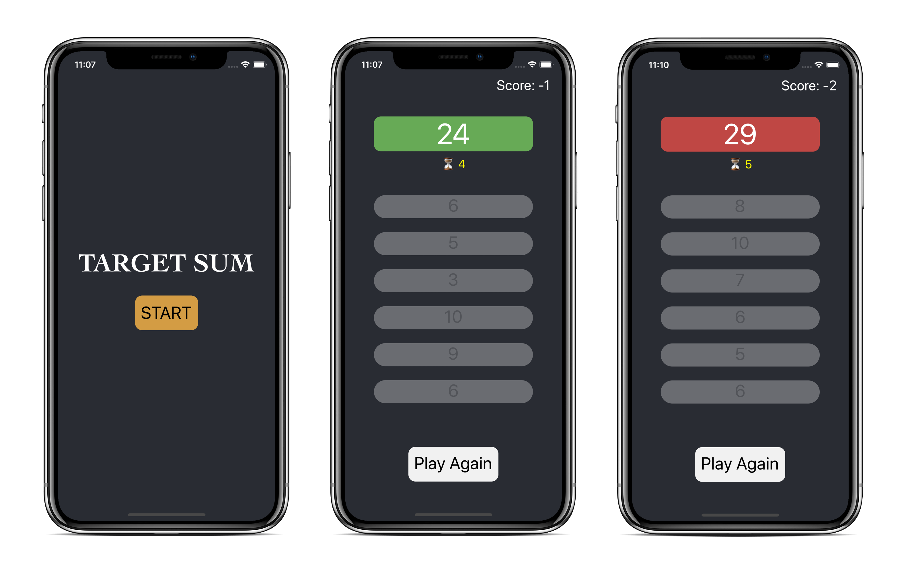

# TargetSum

A simple mathematical game of picking numbers that sum to the target.

The game is written in React Native with basic features:

- All numbers are generated randomly.
- The higher score the user gets, the harder the game is.
- The user has to pick all correct numbers before timeout to win the game.